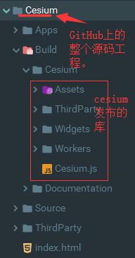

# D3_WebGIS_Main

## 概述
这个项目是进行小型3D WebGIS开发测试的工程。

## 缺失库的情况
<table>
<thead>
<tr>
<th>缺失的目录</th>
<th>获取途径</th>
<th">备注</th>
</tr>
</thead>
<tr>
<th>D3_WebGIS_Main/Cesium</th>
<th>https://cesiumjs.org/downloads/</th>
<th>可以下载其源代码，然后整体的放入以上位置。</th>
</tr>
<tr>
<th>T_WebGIS/cesium/Cesium</th>
<th>https://cesiumjs.org/downloads/</th>
<th>同上，但可以使用build后的Cesium发布包,其目录为"Cesium/Build/"</th>
</tr>
<tr>
<th>T_WebGIS/LIB/GISServer</th>
<th></th>
<th></th>
</tr>
<tr>
<th>T_WebGIS/LIB/ol-cesium</th>
<th>http://openlayers.org/ol-cesium/</th>
<th>OpenLayer版本的Cesium</th>
</tr>
<tr>
<th>T_WebGIS/LIB/openlayers</th>
<th>https://github.com/openlayers/openlayers</th>
<th>openlayer 库</th>
</tr>
</table>

例如，从github上获取的cesium的整个源码结构如下图所示，上表中的"Cesium/Build/".
 

